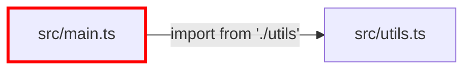

# Radius Code Visualization

Generate Mermaid diagrams to visualize code structure and relationships.

## Commands

### Module Dependency Graph

Visualize import/export relationships:

```bash
radius graph imports <file> [--depth=N]
```

Options:
- `--depth`: Dependency depth (default: 1, max: 3)

Shows:
- Files that the target imports from
- Files that import the target
- External vs internal dependencies

### Variable Reference Graph

Visualize all references to a symbol:

```bash
radius graph refs <file> <symbol>
```

Shows:
- Definition location with code context
- All reference locations with surrounding code
- Up to 30 references (truncated if more)

### Function Call Graph

Visualize function call relationships:

```bash
radius graph calls <file> <function>
```

Shows:
- Incoming calls (who calls this function)
- Outgoing calls (what this function calls)
- Call hierarchy with code context

## Output Format

All commands return Mermaid diagram syntax that can be:
- Rendered in Markdown viewers
- Pasted into Mermaid Live Editor
- Used in documentation

Example output:


## Guidelines

1. Use `graph imports` to understand module architecture
2. Use `graph refs` before refactoring to see impact scope
3. Use `graph calls` to understand function dependencies
4. LSP provides accurate results; text fallback is used if LSP unavailable
5. Engine information is included in output (lsp vs text)

## Examples

Analyze module dependencies:

```bash
radius graph imports src/core/commands/graph.ts --depth=2
```

Find all references to a variable:

```bash
radius graph refs src/lsp/client.ts LspClient
```

Visualize function call hierarchy:

```bash
radius graph calls src/core/graph/imports.ts generateImportGraph
```

## Integration with Other Tools

Combine with other Radius commands:

```bash
# View file structure first
radius view src/main.ts

# Then visualize dependencies
radius graph imports src/main.ts

# Analyze specific variable usage
radius graph refs src/main.ts config
```
